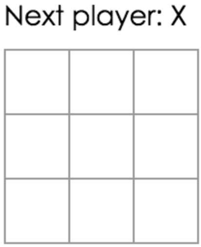
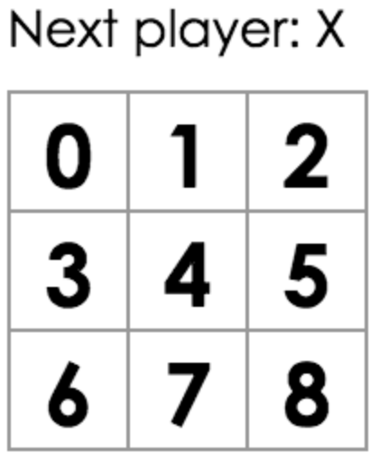

# Tutorial: Intro to React

https://reactjs.org/tutorial/tutorial.html

## Before We Start the Tutorial

### What Are We Building?

Final Result: https://codepen.io/gaearon/pen/gWWZgR?editors=0010

### Prerequisites

- [ ] https://developer.mozilla.org/en-US/docs/Web/JavaScript/A_re-introduction_to_JavaScript

#### Arrow functions

https://developer.mozilla.org/en-US/docs/Web/JavaScript/Reference/Functions/Arrow_functions
- Syntactically compact alternative to a regular function expression, 
- without its own bindings to the `this`, `arguments`, `super`, or `new.target` 
- Arrow function expressions are ill suited as **methods**
- they cannot be used as constructors.
- doesn't require explicit `that = this`

<details><summary>:construction: Example Arrow functions</summary><p>

```javascript
var elements = [ 'Hydrogen', 'Helium', 'Lithium', 'Beryllium' ];

// This statement returns the array: [8, 6, 7, 9]
elements.map(function(element) { return element.length; }); 

// equivalent to
elements.map((element) => { return element.length; }); 

// When there is only one parameter, we can remove the surrounding parentheses
elements.map(element => { return element.length; }); 

// When the only statement in an arrow function is `return`, we can remove `return` and remove
// the surrounding curly brackets
elements.map(element => element.length); // [8, 6, 7, 9]

// In this case, because we only need the length property, we can use destructuring parameter:
// Notice that the `length` corresponds to the property we want to get whereas the
// obviously non-special `lengthFooBArX` is just the name of a variable which can be changed
// to any valid variable name you want
elements.map(({ length :lengthFooBArX }) => lengthFooBArX); // [8, 6, 7, 9]

// This destructuring parameter assignment can also be written as seen below. However, note that in
// this example we are not assigning `length` value to the made up property. Instead, the literal name
// itself of the variable `length` is used as the property we want to retrieve from the object.
elements.map(({ length }) => length); // [8, 6, 7, 9]
```
</p></details>

<details><summary>:construction: Arrow functions with this</summary><p>

```javascript
function Person(){
  this.age = 0; // without arrow function you would have to `that = this`

  setInterval(() => {
    this.age++; // |this| properly refers to the Person object
  }, 1000);

}

var p = new Person();
```
</p></details>

#### Classes

https://developer.mozilla.org/en-US/docs/Web/JavaScript/Reference/Classes

### let

https://developer.mozilla.org/en-US/docs/Web/JavaScript/Reference/Statements/let
- `let x = 1;`

### const

https://developer.mozilla.org/en-US/docs/Web/JavaScript/Reference/Statements/const
- `const number = 42;` cannot be reassigned or redeclared

## Setup for the Tutorial

### Option 2: Local Development Environment

[:ship: 4e7dfa8](https://github.com/arafatm/tutorial_intro_to_react/commit/421395e9585c0c50309abdf4c8ce2bb2c4e7dfa8)
```bash
npx create-react-app my-app
```

[:ship: d787d08](https://github.com/arafatm/tutorial_intro_to_react/commit/d787d08) clean src folder
```bash
rm -f src/*
```

[:ship: 9f8d3d8](https://github.com/arafatm/tutorial_intro_to_react/commit/9f8d3d8) copy base code for this tutorial

## Overview

### What Is React?

Compose complex UIs from small and isolated **components**

A `React.Component` 
- takes in parameters, called `props`  
- returns a hierarchy of views to display via the `render` method.

### Inspecting the Starter Code

Inspecting [9f8d3d8](https://github.com/arafatm/tutorial_intro_to_react/commit/9f8d3d8)
- there are 3 components: square, board, game
- square renders a single `<button>`
- board renders 9 squares
- game renders a board

### Passing Data Through Props

| Before | After | 
| ------ | ----- |
|  |  |


[:ship: 2f82d91](https://github.com/arafatm/tutorial_intro_to_react/commit/2f82d91) 1st example passing props. Note the board now displays the square index
- `this.props.value`

### Making an Interactive Component

[:ship: 51beb08](https://github.com/arafatm/tutorial_intro_to_react/commit/51beb08) example interactivity with onClick

[:ship: 6bd6394](https://github.com/arafatm/tutorial_intro_to_react/commit/6bd6394) interactive with =>
- refactor `function()` to `() =>` 
- avoids confusing `this` behavior
- Note: this will not work as expected `onClick={alert('click')}`

#### Remembering State

[:ship: f84b6de](https://github.com/arafatm/tutorial_intro_to_react/commit/f84b6de) Square constructor to remember state
- Add state to a component with `this.state` in the constructor
- constructor should start with `super(props);` if it's a baseclass e.g. `extends React.Component`

[:ship: 3269d53](https://github.com/arafatm/tutorial_intro_to_react/commit/3269d53) change Square to render current state when clicked
- `setState` automatically updates child components

### Developer Tools

Use **React Developer Tools** to debug

## Completing the Game

### Lifting State Up

To collect data from multiple children, or to have two child components
communicate with each other, you need to declare the shared state in their
parent component instead. The parent component can pass the state back down to
the children by using props; this keeps the child components in sync with each
other and with the parent component.

xxx

### Why Immutability Is Important

### Function Components

### Taking Turns

### Declaring a Winner

## Adding Time Travel

### Storing a History of Moves

### Lifting State Up, Again

### Showing the Past Moves

### Picking a Key

### Implementing Time Travel

### Wrapping Up

